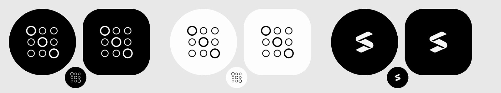

# 0006 — Icono de la app (Android primero)

Estado: **propuesta, esperando al dueño** · Contexto: el dueño prioriza Android sobre iOS (8 oct).

## Para el dueño

La app aún lleva el icono de ejemplo de Expo (una flecha azul). Es lo primero que se ve en un móvil Android, así que elige uno de estos tres; Claude prepara los archivos que pide Android (primer plano, fondo y versión monocroma) cuando decidas.

| Opción | Qué es |
|---|---|
| **A · matriz negra** (recomendada) | La cuadrícula 3×3 de choisys en blanco sobre negro; tres círculos marcados en diagonal, como un recorrido. Mismo lenguaje que el cubo y la landing. |
| **A · matriz papel** | Lo mismo en negro sobre blanco papel `#fdfdfd`. Se pierde algo en fondos de pantalla claros. |
| **B · S de scenarys** | La marca de la compañía. Clara, pero no dice «choisys». |

Los círculos son solo forma: no representan datos de nadie ni ninguna inferencia.

## Si no decides

La app sigue con el icono de Expo y la build de Android saldría con él.
